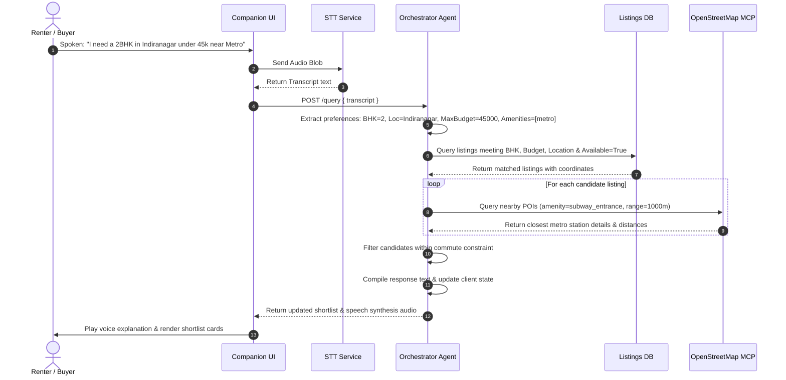
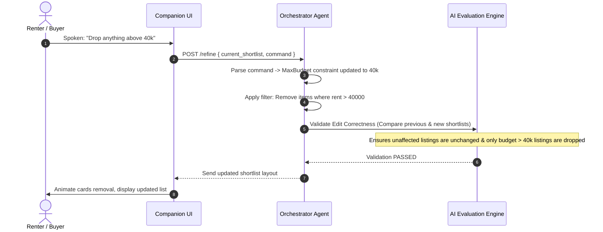
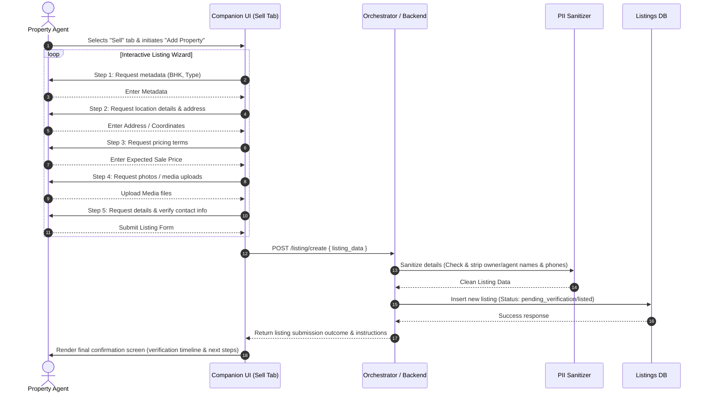

# Architecture Design: Voice-First AI Property Scout

This document outlines the system architecture, component design, data flow, and technology stack for the voice-first AI Property Scout assistant based on [ProblemStatement.md](file:///Users/aarushigrover/Desktop/Capstone%20project-%20Property%20Scout/ProblemStatement.md).

---

## 1. System Architecture Overview

The system is designed as a decoupled client-server application featuring an AI Orchestrator that coordinates user voice queries, a vector database for RAG, an MCP integration client for real-time location/transit checks, and an automated background workflow (n8n) for document generation.

```mermaid
graph TD
    %% Clients
    subgraph Client [Client / Companion UI]
        UI["React / Next.js Web App"]
        Audio["Web Audio API (Capture)"]
        STT["Speech-To-Text (Whisper / Deepgram)"]
    end

    %% Backend Orchestration
    subgraph Server [Backend Server]
        Orch["Agent Orchestration Loop (Node.js/TypeScript)"]
        Parser["Query Parser & State Manager"]
        PII["PII Sanitizer & Data Cleaner"]
        Eval["AI Evaluation Engine"]
    end

    %% Data & Storage
    subgraph Data [Data & Storage Layer]
        Scraper["Cheerio / Puppeteer Scraper"]
        SourceWeb["bengaluru.rent"]
        ListingDB[("Listings DB (SQLite / PostgreSQL)")]
        VectorDB[("Vector DB (Chroma / Pinecone)")]
        Embeddings["Embedding Generator"]
        WikiGuides["Wikipedia & Neighborhood Guides"]
    end

    %% MCP Integration
    subgraph MCP [MCP Integration Layer]
        MCPClient["MCP Client"]
        OSM["OpenStreetMap MCP Server"]
    end

    %% Automation
    subgraph Automation [Automation Layer]
        n8n["n8n Workflow Engine"]
        PDF["PDF Generator Node"]
        Email["Email Service (SMTP / Resend)"]
    end

    %% Flow Connections
    UI -->|1. Audio Stream / Chunk| Audio
    Audio -->|2. Transmit Audio| STT
    STT -->|3. Transcript Text| Orch
    Orch -->|4. Extracted Preferences| Parser
    
    %% Scraper flow
    Scraper -->|Scrape listings| SourceWeb
    Scraper -->|Filter & Sanitise| PII
    PII -->|Save Available Listings| ListingDB

    %% RAG Ingestion
    WikiGuides -->|Chunk & Embed| Embeddings
    Embeddings -->|Store Embeddings| VectorDB

    %% Orchestrator Queries
    Parser -->|Query Available Listings| ListingDB
    Orch -->|Vector Search (Context)| VectorDB
    Orch -->|Find Amenities / Transit| MCPClient
    MCPClient -->|Geodata Request| OSM
    OSM -->|Transit & POI Data| MCPClient
    
    %% Output Validation & Execution
    Orch -->|Validate Response| Eval
    Orch -->|Render Update (WebSocket / HTTP)| UI
    
    %% Export Trigger
    Orch -->|Trigger PDF Export (Webhook)| n8n
    n8n --> PDF
    PDF --> Email
    Email -->|Email Sent Confirmation| Orch
```

---

## 2. Component Deep Dive

### 2.1 Frontend (Companion UI)
*   **Audio Capture**: Utilizes the browser's `MediaRecorder` API or `Web Audio API` to stream or send audio blobs to the transcription service.
*   **Dual-Mode Layout**: Toggleable agent views partitioned into:
    *   **Buy Mode**: Contains the **Shortlist Panel** (listing cards), **Neighborhood Snapshot Panel** (transit/safety notes via OSM/RAG), **Mic Control & Transcription Overlay** (voice assistant integration), **Sources/References** drawer (citations), and **Booking Panel** (appointment management).
    *   **Sell Mode**: A structured **Step-by-Step Listing Wizard** that guides the agent through input fields (metadata, location, terms/price, media upload) and outputs a confirmation listing status screen.
*   **Global Layout Elements**:
    *   **Footer & Navigation Section**: Static navigation bar fixed to the viewport's bottom. Integrates responsive navigation links for:
        *   *About Us* (platform overview)
        *   *Contact Us* (support/contact coordinates and form overlay)
        *   *Terms & Conditions* and *Privacy Policy* (legal pages/modals with a trust-centric layout)
        *   *FAQs* (static query accordion for common troubleshooting)

### 2.2 Backend Orchestrator
*   **State Management Engine**: Tracks user filters (budget, bedrooms, must-haves, commute-anchor point) and conversation state (number of clarifying questions asked, limit = 5).
*   **Natural Language Parser**: Parses transcriptions into actionable state modifications:
    *   *Intent Classification*: Determines if the input is a preference statement, a shortlist refinement, a reasoning question, or a booking action.
    *   *Constraint Parsing*: Extracts entities like `"35k"` (budget: max 35,000), `"Koramangala"` (location), and `"parking"` (amenity).
*   **PII Sanitizer**: A regular-expression and NER-based (Named Entity Recognition) cleaning module that strips phone numbers, email addresses, and contact names from listing records before persistence.

### 2.3 MCP Client
*   **OpenStreetMap Integration**: Communicates via JSON-RPC with the `open-streetmap-mcp` server.
*   **Coordination Lookup**: Translates coordinates of listings scraped from `bengaluru.rent` into geo-queries. Finds bus stops, metro stations, grocery stores, and hospitals within defined radii (e.g., 500m, 1km).

### 2.4 RAG Engine
*   **Vector Database**: Stores pre-embedded neighborhood records from four source files under the RAG folder (`RAG/README.md`, `RAG/sources.jsonl`, `RAG/localities.jsonl`, `RAG/safety_sources.jsonl`) with metadata preserved (Source ID, Name, Type, URL, Verification Date).
*   **Embedding Model**: Uses the **`BAAI/bge-small-en-v1.5`** open-source embedding model to map text content to high-density vector representations.
*   **Chunking Strategy**: Implements strict **record-level chunking** for the RAG database. Each complete JSON line in `localities.jsonl` and `safety_sources.jsonl` constitutes exactly one chunk. Character-based, sentence-based, or sliding-window splitting is disabled to prevent separating factual claims from citations.
*   **Vector Construction**: Creates an `embedding_text` field combining relevant metadata (locality name, region, supported topics) with the content itself, then indexes this text for vector matching.
*   **Retrieval Pipeline**: Exposes a query interface that triggers semantic retrieval only for neighborhood character, development, history, neighborhood-level guidance, or explanations. It explicitly blocks retrieval or output construction for active listing availability, pricing, or distance math (deferring these respectively to the listings database and the OpenStreetMap MCP).
*   **Grounding & Verification Module**:
    *   Verifies that any neighborhood factual answer is explicitly supported by retrieved chunks, returning a "verified information is unavailable" notification if the evidence is insufficient.
    *   Resolves source IDs in retrieved fragments to URLs defined in `RAG/sources.jsonl`.
    *   Exposes conflicting evidence when sources disagree instead of silently picking one.
    *   Enforces a strict safety policy: safety queries pull from `RAG/safety_sources.jsonl` but forbid binary "safe/unsafe" ratings unless explicitly backed by retrieved evidence.

### 2.5 n8n Workflow
*   **Webhook Trigger**: Receives shortlist JSON payload and user email from the Backend Orchestrator.
*   **PDF Generation**: Converts HTML template containing shortlist properties, map thumbnails, and commute summaries into a print-ready PDF document.
*   **Mail Transfer Agent**: Sends the PDF as an attachment to the user's email address with a summary greeting.

---

## 3. Detailed Data Flows

### Sequence A: Conversational Preference Collection & Search



### Sequence B: Voice-Based Shortlist Refinement



### Sequence C: Guided Property Listing (Sell Tab)



---

## 4. AI Evaluation Framework

The system embeds automated run-time and test-time evaluation pipelines to ensure quality and prevent hallucinations.

| Evaluation Suite | Type | Mechanism | Target Metric |
| :--- | :--- | :--- | :--- |
| **Feasibility Eval** | Rule-Based & LLM-Assisted | Validates that all shortlisted listings strictly conform to user-specified parameters (BHK, price caps, commute duration). | 100% compliance on strict constraints. |
| **Edit Correctness Eval** | Structural JSON Diff | Compares the listing IDs in the shortlist before and after a voice instruction to verify only matching items were deleted/added. | Zero accidental mutations of unrelated listings. |
| **Grounding & Hallucination Eval** | LLM-As-A-Judge | Cross-checks output claims about transit distances and safety records against context retrieved from OSM MCP and RAG vector store. | Zero claims generated without valid source URLs/citations. |

---

## 5. Technology Stack Recommendations

*   **Frontend**: React (Vite) / Next.js, Tailwind CSS (for layout and snapshot design), Lucide Icons, Web Audio API.
*   **Backend**: Node.js with Fastify or Express (TypeScript) or FastAPI (Python).
*   **Orchestration**: LangChain / Vercel AI SDK (with Gemini 3.6 Flash) and **`BAAI/bge-small-en-v1.5`** embeddings.
*   **Scraper**: Puppeteer / Cheerio running in a scheduled Serverless Function.
*   **Database**:
    *   *Structured Data*: SQLite (for lightweight prototyping) or PostgreSQL.
    *   *Unstructured RAG Data*: ChromaDB (local/in-memory) or Pinecone.
*   **Integration**:
    *   MCP Client: `@modelcontextprotocol/sdk` (Node.js).
    *   Automation: n8n (self-hosted or cloud instance).

---

## 6. Defensive Architecture & Corner Scenario Matrix

Comprehensive mapping of failure modes, Web Audio API constraints, circuit breaker limits, RAG chunking rules, PII sanitization regexes, MCP transit fallbacks, and n8n notification fallbacks is documented in [edge-case.md](file:///Users/aarushigrover/Desktop/Capstone%20project-%20Property%20Scout/edge-case.md).

